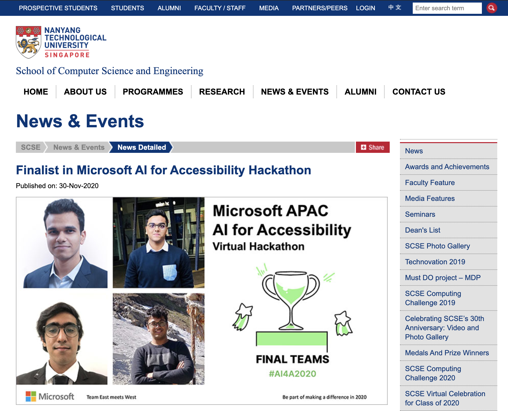

# Microsoft AI for Accesibility Hackathon
> Finalist in the APAC region

The Microsoft APAC AI for Accessibility hackathon took place virtually from 30 Oct to 24 Nov 2020 in the Asia Pacific Region, organized by Microsoft and supported by LinkedIn, Datacom, and others. The goal is for teams to develop working prototypes of AI solutions that can transform the daily life, employability and communication for people with disabilities on real problem statements identified by local non-profit partners and government representatives provided on the website.

Throughout the Asia Pacific region, more than 180 teams participated in the hackathon with 570+ members, to harness the power of AI to amplify human capability, with and for the more than one billion people around the world with a disability. Our team from NTU qualified as one of the **top 5 submissions from Singapore** and represented Singapore, to a stream of regional Microsoft & partner judges in a final pitching session.

We developed a technical solution for Microsoft Teams, powered by Microsoft Azure, which leverages AI to create a better video-conferencing experience for individuals with visual impairment or other disorders that affect their ability to perceive emotions from facial expressions. 

With the COVID-19 pandemic, work from home is the new norm and video conferencing tools are at the foreground of collaboration. Visually impaired individuals find it difficult to read facial expressions in such a setting and are deprived of important non-verbal cues. Our application leverages Artificial Intelligence with the help of Microsoft Azure to provide live sentiment analysis on the facial expressions of the participants in a video conference. It also helps users align their web cameras appropriately before entering a meeting.

## Authors
* Aditya Bansal
* Jay Gupta
* Ritwik Kanodia
* Vidurveer Duggal
